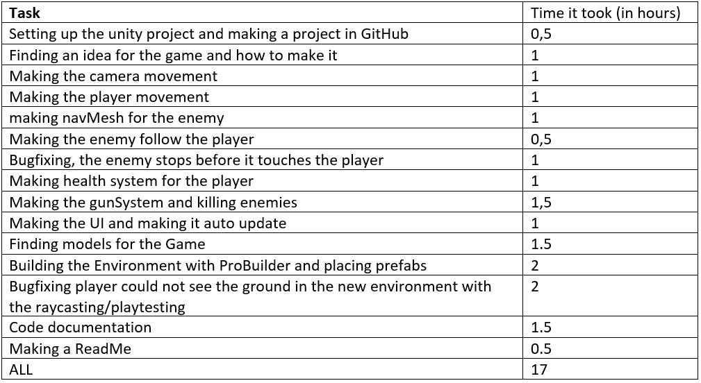

# Pi3D Mini-project

## Overview of the Game
The objective of the project was to create a Half-Life-like game where players explore an area and engage with enemies. In the game, players control a character armed with a shotgun, which has four shots in the magazine. The enemies are represented as small green boxes, and players navigate using "W," "A," "S," and "D" keys, while adjusting their view with the mouse. The left mouse click is used for shooting. The player starts with 100 hit points, and if it reaches 0, the game restarts. Additionally, when the player runs out of ammunition, they can press "R" to reload the weapon.

The main parts of the game are:
-	Player - moved around with WASD
-	Enemies – boxes, moves around the game area following a nav-mesh and follows the player when he is in a specific range. Damages the player when they touch. 
- 	Hit Points – The player starts with 100 HP and lose it if damaged by a enemy, if it hits 0 the game restarts. 
- 	Camera – Follows the players position and looks around with the help of the mouse. 
- 	Weapon – The shotgun fires 6 bullets each time you shot with a different offset from the main raycast so the weapon can hit enemies over a larger area. If and enemy is hit it kills the enemy. 
-   Map – There is a map build with Probuilder. It is a hollow out shape that gives the corridor feel so the player does not know where the enemies will come from and must explores the area.

Features:
-	The player can be controlled and shot enemies. 
- 	The enemies follow the player around the map using a navmesh. 
- 	The player can kill enemies and be killed by them.

## Running It
1. download Unity >= 2020.3.25f1
2. clone or Download the project
3. The needs a mouse and keyboard

## Project parts

### Scripts
-	MoveCamera - used for moving the cameras position. 
- 	PlayerCamera – used for rotating the camera follow the way the player is looking. 
-   PlayerHealth – used for controlling the players health and restarting the game if it is below 0. 
-   PlayerMovement – used for moving the player around the sceen and jumping. 
-   CamShake – used for shaking the camera if the player shots the gun. 
- 	PlayerStatus – used for displaying the player movement speed, health and ammo. 
- 	EnemyAttack – makes the enemy attack the player if they touch and has a function for kill the enemy. 
-   EnemyFollow – makes the enemy follow the player. 
-   GunSystem – Makes a gun that can shoot with raycast and damage enemies.

### Models & prefabs
- Ammo boxes downloaded from: https://assetstore.unity.com/packages/3d/props/weapons/ammo-box-7701 
- Moving boxes with pallets downloaded from: https://assetstore.unity.com/packages/3d/boxes-63740 
- Cardboard boxes downloaded from: https://assetstore.unity.com/packages/3d/props/industrial/cardboard-boxes-pack-hd-202666 
- Medieval barrels and boxes downloaded from: https://assetstore.unity.com/packages/3d/props/exterior/medieval-barrels-and-boxes-137474 
- Shotgun Set downloaded From: https://assetstore.unity.com/packages/3d/props/weapons/shotgun-set-196408 
- Enemies and player prefab made from a Unity primitive.

## References
- 	Unity NavMesh Tutorial – Basics - https://www.youtube.com/watch?v=CHV1ymlw-P8&ab_channel=Brackeys 
- 	Camera Shake in unity - https://www.youtube.com/watch?v=9A9yj8KnM8c&t=498s&ab_channel=Brackeys 
- How to make ALL kinds of GUNS with just ONE script! (Unity3d tutorial) - https://www.youtube.com/watch?v=bqNW08Tac0Y&ab_channel=Dave%2FGameDevelopment 
- 	FIRST PERSON MOVEMENT in 10 MINUTES - Unity Tutorial - https://www.youtube.com/watch?v=f473C43s8nE&t=32s&ab_channel=Dave%2FGameDevelopment